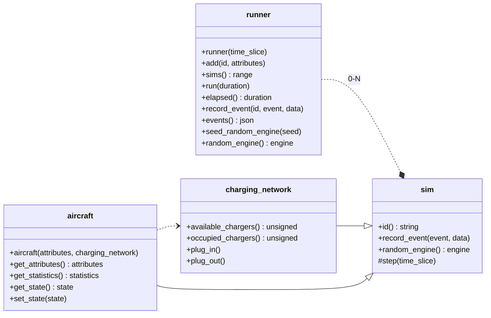

# eEVTOL Simulator Demo Project

[](https://github.com/DavidLeeds/evtol-sim/actions/workflows/ci.yml)

## Usage

### Build

> Note: Requires CMake and C++ '20. Recommended build environment: Ubuntu 22.04 or 24.04

```
mkdir build
cd build
cmake -DEVTOL_BUILD_TESTS=ON ..
cmake --build .
```

### Run Unit Tests

```
ctest
```

### Run Simulator

```
./evtol-sim
```

## Class Structure



## Example Simulation

### Constraints

* 20 aircraft in simulation
* 5 aircraft models (randomized)
* 3 hour run time

### Output


```json
{
  "events": [
    {
      "data": {
        "batteryEnergyKwh": 320.0,
        "batteryPercent": 100.0,
        "chargeCount": 0,
        "chargeTime": 0.0,
        "faultCount": 0,
        "flightCount": 1,
        "flightMiles": 0.0,
        "flightTime": 0.0,
        "state": "Flying"
      },
      "event": "StateChanged",
      "id": "EV001",
      "timestamp": 0.0
    },
    {
      "data": {
        "batteryEnergyKwh": 320.0,
        "batteryPercent": 100.0,
        "chargeCount": 0,
        "chargeTime": 0.0,
        "faultCount": 0,
        "flightCount": 1,
        "flightMiles": 0.0,
        "flightTime": 0.0,
        "state": "Flying"
      },
      "event": "StateChanged",
      "id": "EV002",
      "timestamp": 0.0
    },
    {
      "data": {
        "batteryEnergyKwh": 120.0,
        "batteryPercent": 100.0,
        "chargeCount": 0,
        "chargeTime": 0.0,
        "faultCount": 0,
        "flightCount": 1,
        "flightMiles": 0.0,
        "flightTime": 0.0,
        "state": "Flying"
      },
      "event": "StateChanged",
      "id": "EV003",
      "timestamp": 0.0
    },
    {
      "data": {
        "batteryEnergyKwh": 220.0,
        "batteryPercent": 100.0,
        "chargeCount": 0,
        "chargeTime": 0.0,
        "faultCount": 0,
        "flightCount": 1,
        "flightMiles": 0.0,
        "flightTime": 0.0,
        "state": "Flying"
      },
      "event": "StateChanged",
      "id": "EV004",
      "timestamp": 0.0
    },
    {
      "data": {
        "batteryEnergyKwh": 220.0,
        "batteryPercent": 100.0,
        "chargeCount": 0,
        "chargeTime": 0.0,
        "faultCount": 0,
        "flightCount": 1,
        "flightMiles": 0.0,
        "flightTime": 0.0,
        "state": "Flying"
      },
      "event": "StateChanged",
      "id": "EV005",
      "timestamp": 0.0
    },
    {
      "data": {
        "batteryEnergyKwh": 100.0,
        "batteryPercent": 100.0,
        "chargeCount": 0,
        "chargeTime": 0.0,
        "faultCount": 0,
        "flightCount": 1,
        "flightMiles": 0.0,
        "flightTime": 0.0,
        "state": "Flying"
      },
      "event": "StateChanged",
      "id": "EV006",
      "timestamp": 0.0
    },
    {
      "data": {
        "batteryEnergyKwh": 320.0,
        "batteryPercent": 100.0,
        "chargeCount": 0,
        "chargeTime": 0.0,
        "faultCount": 0,
        "flightCount": 1,
        "flightMiles": 0.0,
        "flightTime": 0.0,
        "state": "Flying"
      },
      "event": "StateChanged",
      "id": "EV007",
      "timestamp": 0.0
    },
    {
      "data": {
        "batteryEnergyKwh": 120.0,
        "batteryPercent": 100.0,
        "chargeCount": 0,
        "chargeTime": 0.0,
        "faultCount": 0,
        "flightCount": 1,
        "flightMiles": 0.0,
        "flightTime": 0.0,
        "state": "Flying"
      },
      "event": "StateChanged",
      "id": "EV008",
      "timestamp": 0.0
    },
    {
      "data": {
        "batteryEnergyKwh": 120.0,
        "batteryPercent": 100.0,
        "chargeCount": 0,
        "chargeTime": 0.0,
        "faultCount": 0,
        "flightCount": 1,
        "flightMiles": 0.0,
        "flightTime": 0.0,
        "state": "Flying"
      },
      "event": "StateChanged",
      "id": "EV009",
      "timestamp": 0.0
    },
    {
      "data": {
        "batteryEnergyKwh": 150.0,
        "batteryPercent": 100.0,
        "chargeCount": 0,
        "chargeTime": 0.0,
        "faultCount": 0,
        "flightCount": 1,
        "flightMiles": 0.0,
        "flightTime": 0.0,
        "state": "Flying"
      },
      "event": "StateChanged",
      "id": "EV010",
      "timestamp": 0.0
    },
    {
      "data": {
        "batteryEnergyKwh": 100.0,
        "batteryPercent": 100.0,
        "chargeCount": 0,
        "chargeTime": 0.0,
        "faultCount": 0,
        "flightCount": 1,
        "flightMiles": 0.0,
        "flightTime": 0.0,
        "state": "Flying"
      },
      "event": "StateChanged",
      "id": "EV011",
      "timestamp": 0.0
    },
    {
      "data": {
        "batteryEnergyKwh": 220.0,
        "batteryPercent": 100.0,
        "chargeCount": 0,
        "chargeTime": 0.0,
        "faultCount": 0,
        "flightCount": 1,
        "flightMiles": 0.0,
        "flightTime": 0.0,
        "state": "Flying"
      },
      "event": "StateChanged",
      "id": "EV012",
      "timestamp": 0.0
    },
    {
      "data": {
        "batteryEnergyKwh": 150.0,
        "batteryPercent": 100.0,
        "chargeCount": 0,
        "chargeTime": 0.0,
        "faultCount": 0,
        "flightCount": 1,
        "flightMiles": 0.0,
        "flightTime": 0.0,
        "state": "Flying"
      },
      "event": "StateChanged",
      "id": "EV013",
      "timestamp": 0.0
    },
    {
      "data": {
        "batteryEnergyKwh": 320.0,
        "batteryPercent": 100.0,
        "chargeCount": 0,
        "chargeTime": 0.0,
        "faultCount": 0,
        "flightCount": 1,
        "flightMiles": 0.0,
        "flightTime": 0.0,
        "state": "Flying"
      },
      "event": "StateChanged",
      "id": "EV014",
      "timestamp": 0.0
    },
    {
      "data": {
        "batteryEnergyKwh": 320.0,
        "batteryPercent": 100.0,
        "chargeCount": 0,
        "chargeTime": 0.0,
        "faultCount": 0,
        "flightCount": 1,
        "flightMiles": 0.0,
        "flightTime": 0.0,
        "state": "Flying"
      },
      "event": "StateChanged",
      "id": "EV015",
      "timestamp": 0.0
    },
    {
      "data": {
        "batteryEnergyKwh": 220.0,
        "batteryPercent": 100.0,
        "chargeCount": 0,
        "chargeTime": 0.0,
        "faultCount": 0,
        "flightCount": 1,
        "flightMiles": 0.0,
        "flightTime": 0.0,
        "state": "Flying"
      },
      "event": "StateChanged",
      "id": "EV016",
      "timestamp": 0.0
    },
    {
      "data": {
        "batteryEnergyKwh": 120.0,
        "batteryPercent": 100.0,
        "chargeCount": 0,
        "chargeTime": 0.0,
        "faultCount": 0,
        "flightCount": 1,
        "flightMiles": 0.0,
        "flightTime": 0.0,
        "state": "Flying"
      },
      "event": "StateChanged",
      "id": "EV017",
      "timestamp": 0.0
    },
    {
      "data": {
        "batteryEnergyKwh": 320.0,
        "batteryPercent": 100.0,
        "chargeCount": 0,
        "chargeTime": 0.0,
        "faultCount": 0,
        "flightCount": 1,
        "flightMiles": 0.0,
        "flightTime": 0.0,
        "state": "Flying"
      },
      "event": "StateChanged",
      "id": "EV018",
      "timestamp": 0.0
    },
    {
      "data": {
        "batteryEnergyKwh": 100.0,
        "batteryPercent": 100.0,
        "chargeCount": 0,
        "chargeTime": 0.0,
        "faultCount": 0,
        "flightCount": 1,
        "flightMiles": 0.0,
        "flightTime": 0.0,
        "state": "Flying"
      },
      "event": "StateChanged",
      "id": "EV019",
      "timestamp": 0.0
    },
    {
      "data": {
        "batteryEnergyKwh": 320.0,
        "batteryPercent": 100.0,
        "chargeCount": 0,
        "chargeTime": 0.0,
        "faultCount": 0,
        "flightCount": 1,
        "flightMiles": 0.0,
        "flightTime": 0.0,
        "state": "Flying"
      },
      "event": "StateChanged",
      "id": "EV020",
      "timestamp": 0.0
    },
    {
      "data": {
        "availableChargers": 2,
        "occupiedChargers": 1
      },
      "event": "PlugIn",
      "id": "Charging Network",
      "timestamp": 2250.0
    },
    {
      "data": {
        "batteryEnergyKwh": 0.0,
        "batteryPercent": 0.0,
        "chargeCount": 1,
        "chargeTime": 0.0,
        "faultCount": 0,
        "flightCount": 1,
        "flightMiles": 100.00000000000541,
        "flightTime": 2250.0,
        "state": "Charging"
      },
      "event": "StateChanged",
      "id": "EV004",
      "timestamp": 2250.0
    },
    {
      "data": {
        "availableChargers": 1,
        "occupiedChargers": 2
      },
      "event": "PlugIn",
      "id": "Charging Network",
      "timestamp": 2250.0
    },
    {
      "data": {
        "batteryEnergyKwh": 0.0,
        "batteryPercent": 0.0,
        "chargeCount": 1,
        "chargeTime": 0.0,
        "faultCount": 0,
        "flightCount": 1,
        "flightMiles": 100.00000000000541,
        "flightTime": 2250.0,
        "state": "Charging"
      },
      "event": "StateChanged",
      "id": "EV005",
      "timestamp": 2250.0
    },
    {
      "data": {
        "availableChargers": 0,
        "occupiedChargers": 3
      },
      "event": "PlugIn",
      "id": "Charging Network",
      "timestamp": 2250.0
    },
    {
      "data": {
        "batteryEnergyKwh": 0.0,
        "batteryPercent": 0.0,
        "chargeCount": 1,
        "chargeTime": 0.0,
        "faultCount": 1,
        "flightCount": 1,
        "flightMiles": 100.00000000000541,
        "flightTime": 2250.0,
        "state": "Charging"
      },
      "event": "StateChanged",
      "id": "EV012",
      "timestamp": 2250.0
    },
    {
      "data": {
        "batteryEnergyKwh": 0.0,
        "batteryPercent": 0.0,
        "chargeCount": 0,
        "chargeTime": 0.0,
        "faultCount": 0,
        "flightCount": 1,
        "flightMiles": 100.00000000000541,
        "flightTime": 2250.0,
        "state": "QueuedToCharge"
      },
      "event": "StateChanged",
      "id": "EV016",
      "timestamp": 2250.0
    },
    {
      "data": {
        "batteryEnergyKwh": 0.0,
        "batteryPercent": 0.0,
        "chargeCount": 0,
        "chargeTime": 0.0,
        "faultCount": 0,
        "flightCount": 1,
        "flightMiles": 66.6944444444454,
        "flightTime": 2401.0,
        "state": "QueuedToCharge"
      },
      "event": "StateChanged",
      "id": "EV006",
      "timestamp": 2401.0
    },
    {
      "data": {
        "batteryEnergyKwh": 0.0,
        "batteryPercent": 0.0,
        "chargeCount": 0,
        "chargeTime": 0.0,
        "faultCount": 0,
        "flightCount": 1,
        "flightMiles": 66.6944444444454,
        "flightTime": 2401.0,
        "state": "QueuedToCharge"
      },
      "event": "StateChanged",
      "id": "EV011",
      "timestamp": 2401.0
    },
    {
      "data": {
        "batteryEnergyKwh": 0.0,
        "batteryPercent": 0.0,
        "chargeCount": 0,
        "chargeTime": 0.0,
        "faultCount": 0,
        "flightCount": 1,
        "flightMiles": 66.6944444444454,
        "flightTime": 2401.0,
        "state": "QueuedToCharge"
      },
      "event": "StateChanged",
      "id": "EV019",
      "timestamp": 2401.0
    },
    {
      "data": {
        "batteryEnergyKwh": 0.0,
        "batteryPercent": 0.0,
        "chargeCount": 0,
        "chargeTime": 0.0,
        "faultCount": 0,
        "flightCount": 1,
        "flightMiles": 25.86666666666584,
        "flightTime": 3104.0,
        "state": "QueuedToCharge"
      },
      "event": "StateChanged",
      "id": "EV010",
      "timestamp": 3104.0
    },
    {
      "data": {
        "batteryEnergyKwh": 0.0,
        "batteryPercent": 0.0,
        "chargeCount": 0,
        "chargeTime": 0.0,
        "faultCount": 0,
        "flightCount": 1,
        "flightMiles": 25.86666666666584,
        "flightTime": 3104.0,
        "state": "QueuedToCharge"
      },
      "event": "StateChanged",
      "id": "EV013",
      "timestamp": 3104.0
    },
    {
      "data": {
        "availableChargers": 1,
        "occupiedChargers": 2
      },
      "event": "PlugOut",
      "id": "Charging Network",
      "timestamp": 5131.0
    },
    {
      "data": {
        "batteryEnergyKwh": 220.0,
        "batteryPercent": 100.0,
        "chargeCount": 1,
        "chargeTime": 2881.0,
        "faultCount": 0,
        "flightCount": 2,
        "flightMiles": 100.00000000000541,
        "flightTime": 2250.0,
        "state": "Flying"
      },
      "event": "StateChanged",
      "id": "EV004",
      "timestamp": 5131.0
    },
    {
      "data": {
        "availableChargers": 2,
        "occupiedChargers": 1
      },
      "event": "PlugOut",
      "id": "Charging Network",
      "timestamp": 5131.0
    },
    {
      "data": {
        "batteryEnergyKwh": 220.0,
        "batteryPercent": 100.0,
        "chargeCount": 1,
        "chargeTime": 2881.0,
        "faultCount": 0,
        "flightCount": 2,
        "flightMiles": 100.00000000000541,
        "flightTime": 2250.0,
        "state": "Flying"
      },
      "event": "StateChanged",
      "id": "EV005",
      "timestamp": 5131.0
    },
    {
      "data": {
        "availableChargers": 1,
        "occupiedChargers": 2
      },
      "event": "PlugIn",
      "id": "Charging Network",
      "timestamp": 5131.0
    },
    {
      "data": {
        "batteryEnergyKwh": 0.0,
        "batteryPercent": 0.0,
        "chargeCount": 1,
        "chargeTime": 0.0,
        "faultCount": 0,
        "flightCount": 1,
        "flightMiles": 66.6944444444454,
        "flightTime": 2401.0,
        "state": "Charging"
      },
      "event": "StateChanged",
      "id": "EV006",
      "timestamp": 5131.0
    },
    {
      "data": {
        "availableChargers": 0,
        "occupiedChargers": 3
      },
      "event": "PlugIn",
      "id": "Charging Network",
      "timestamp": 5131.0
    },
    {
      "data": {
        "batteryEnergyKwh": 0.0,
        "batteryPercent": 0.0,
        "chargeCount": 1,
        "chargeTime": 0.0,
        "faultCount": 1,
        "flightCount": 1,
        "flightMiles": 25.86666666666584,
        "flightTime": 3104.0,
        "state": "Charging"
      },
      "event": "StateChanged",
      "id": "EV010",
      "timestamp": 5131.0
    },
    {
      "data": {
        "availableChargers": 1,
        "occupiedChargers": 2
      },
      "event": "PlugOut",
      "id": "Charging Network",
      "timestamp": 5131.0
    },
    {
      "data": {
        "batteryEnergyKwh": 220.0,
        "batteryPercent": 100.0,
        "chargeCount": 1,
        "chargeTime": 2881.0,
        "faultCount": 1,
        "flightCount": 2,
        "flightMiles": 100.00000000000541,
        "flightTime": 2250.0,
        "state": "Flying"
      },
      "event": "StateChanged",
      "id": "EV012",
      "timestamp": 5131.0
    },
    {
      "data": {
        "availableChargers": 0,
        "occupiedChargers": 3
      },
      "event": "PlugIn",
      "id": "Charging Network",
      "timestamp": 5131.0
    },
    {
      "data": {
        "batteryEnergyKwh": 0.0,
        "batteryPercent": 0.0,
        "chargeCount": 1,
        "chargeTime": 0.0,
        "faultCount": 1,
        "flightCount": 1,
        "flightMiles": 25.86666666666584,
        "flightTime": 3104.0,
        "state": "Charging"
      },
      "event": "StateChanged",
      "id": "EV013",
      "timestamp": 5131.0
    },
    {
      "data": {
        "availableChargers": 1,
        "occupiedChargers": 2
      },
      "event": "PlugOut",
      "id": "Charging Network",
      "timestamp": 5852.0
    },
    {
      "data": {
        "batteryEnergyKwh": 100.0,
        "batteryPercent": 100.0,
        "chargeCount": 1,
        "chargeTime": 721.0,
        "faultCount": 0,
        "flightCount": 2,
        "flightMiles": 66.6944444444454,
        "flightTime": 2401.0,
        "state": "Flying"
      },
      "event": "StateChanged",
      "id": "EV006",
      "timestamp": 5852.0
    },
    {
      "data": {
        "availableChargers": 0,
        "occupiedChargers": 3
      },
      "event": "PlugIn",
      "id": "Charging Network",
      "timestamp": 5852.0
    },
    {
      "data": {
        "batteryEnergyKwh": 0.0,
        "batteryPercent": 0.0,
        "chargeCount": 1,
        "chargeTime": 0.0,
        "faultCount": 0,
        "flightCount": 1,
        "flightMiles": 66.6944444444454,
        "flightTime": 2401.0,
        "state": "Charging"
      },
      "event": "StateChanged",
      "id": "EV011",
      "timestamp": 5852.0
    },
    {
      "data": {
        "batteryEnergyKwh": 0.0,
        "batteryPercent": 0.0,
        "chargeCount": 0,
        "chargeTime": 0.0,
        "faultCount": 2,
        "flightCount": 1,
        "flightMiles": 199.99999999999122,
        "flightTime": 6000.0,
        "state": "QueuedToCharge"
      },
      "event": "StateChanged",
      "id": "EV001",
      "timestamp": 6000.0
    },
    {
      "data": {
        "batteryEnergyKwh": 0.0,
        "batteryPercent": 0.0,
        "chargeCount": 0,
        "chargeTime": 0.0,
        "faultCount": 0,
        "flightCount": 1,
        "flightMiles": 199.99999999999122,
        "flightTime": 6000.0,
        "state": "QueuedToCharge"
      },
      "event": "StateChanged",
      "id": "EV002",
      "timestamp": 6000.0
    },
    {
      "data": {
        "batteryEnergyKwh": 0.0,
        "batteryPercent": 0.0,
        "chargeCount": 0,
        "chargeTime": 0.0,
        "faultCount": 1,
        "flightCount": 1,
        "flightMiles": 199.99999999999122,
        "flightTime": 6000.0,
        "state": "QueuedToCharge"
      },
      "event": "StateChanged",
      "id": "EV007",
      "timestamp": 6000.0
    },
    {
      "data": {
        "batteryEnergyKwh": 0.0,
        "batteryPercent": 0.0,
        "chargeCount": 0,
        "chargeTime": 0.0,
        "faultCount": 0,
        "flightCount": 1,
        "flightMiles": 199.99999999999122,
        "flightTime": 6000.0,
        "state": "QueuedToCharge"
      },
      "event": "StateChanged",
      "id": "EV014",
      "timestamp": 6000.0
    },
    {
      "data": {
        "batteryEnergyKwh": 0.0,
        "batteryPercent": 0.0,
        "chargeCount": 0,
        "chargeTime": 0.0,
        "faultCount": 0,
        "flightCount": 1,
        "flightMiles": 199.99999999999122,
        "flightTime": 6000.0,
        "state": "QueuedToCharge"
      },
      "event": "StateChanged",
      "id": "EV015",
      "timestamp": 6000.0
    },
    {
      "data": {
        "batteryEnergyKwh": 0.0,
        "batteryPercent": 0.0,
        "chargeCount": 0,
        "chargeTime": 0.0,
        "faultCount": 0,
        "flightCount": 1,
        "flightMiles": 199.99999999999122,
        "flightTime": 6000.0,
        "state": "QueuedToCharge"
      },
      "event": "StateChanged",
      "id": "EV018",
      "timestamp": 6000.0
    },
    {
      "data": {
        "batteryEnergyKwh": 0.0,
        "batteryPercent": 0.0,
        "chargeCount": 0,
        "chargeTime": 0.0,
        "faultCount": 1,
        "flightCount": 1,
        "flightMiles": 199.99999999999122,
        "flightTime": 6000.0,
        "state": "QueuedToCharge"
      },
      "event": "StateChanged",
      "id": "EV020",
      "timestamp": 6000.0
    },
    {
      "data": {
        "batteryEnergyKwh": 0.0,
        "batteryPercent": 0.0,
        "chargeCount": 0,
        "chargeTime": 0.0,
        "faultCount": 0,
        "flightCount": 1,
        "flightMiles": 150.02500000001697,
        "flightTime": 6001.0,
        "state": "QueuedToCharge"
      },
      "event": "StateChanged",
      "id": "EV003",
      "timestamp": 6001.0
    },
    {
      "data": {
        "batteryEnergyKwh": 0.0,
        "batteryPercent": 0.0,
        "chargeCount": 0,
        "chargeTime": 0.0,
        "faultCount": 0,
        "flightCount": 1,
        "flightMiles": 150.02500000001697,
        "flightTime": 6001.0,
        "state": "QueuedToCharge"
      },
      "event": "StateChanged",
      "id": "EV008",
      "timestamp": 6001.0
    },
    {
      "data": {
        "batteryEnergyKwh": 0.0,
        "batteryPercent": 0.0,
        "chargeCount": 0,
        "chargeTime": 0.0,
        "faultCount": 0,
        "flightCount": 1,
        "flightMiles": 150.02500000001697,
        "flightTime": 6001.0,
        "state": "QueuedToCharge"
      },
      "event": "StateChanged",
      "id": "EV009",
      "timestamp": 6001.0
    },
    {
      "data": {
        "batteryEnergyKwh": 0.0,
        "batteryPercent": 0.0,
        "chargeCount": 0,
        "chargeTime": 0.0,
        "faultCount": 2,
        "flightCount": 1,
        "flightMiles": 150.02500000001697,
        "flightTime": 6001.0,
        "state": "QueuedToCharge"
      },
      "event": "StateChanged",
      "id": "EV017",
      "timestamp": 6001.0
    },
    {
      "data": {
        "availableChargers": 1,
        "occupiedChargers": 2
      },
      "event": "PlugOut",
      "id": "Charging Network",
      "timestamp": 6212.0
    },
    {
      "data": {
        "batteryEnergyKwh": 150.0,
        "batteryPercent": 100.0,
        "chargeCount": 1,
        "chargeTime": 1081.0,
        "faultCount": 1,
        "flightCount": 2,
        "flightMiles": 25.86666666666584,
        "flightTime": 3104.0,
        "state": "Flying"
      },
      "event": "StateChanged",
      "id": "EV010",
      "timestamp": 6212.0
    },
    {
      "data": {
        "availableChargers": 2,
        "occupiedChargers": 1
      },
      "event": "PlugOut",
      "id": "Charging Network",
      "timestamp": 6212.0
    },
    {
      "data": {
        "batteryEnergyKwh": 150.0,
        "batteryPercent": 100.0,
        "chargeCount": 1,
        "chargeTime": 1081.0,
        "faultCount": 1,
        "flightCount": 2,
        "flightMiles": 25.86666666666584,
        "flightTime": 3104.0,
        "state": "Flying"
      },
      "event": "StateChanged",
      "id": "EV013",
      "timestamp": 6212.0
    },
    {
      "data": {
        "availableChargers": 1,
        "occupiedChargers": 2
      },
      "event": "PlugIn",
      "id": "Charging Network",
      "timestamp": 6212.0
    },
    {
      "data": {
        "batteryEnergyKwh": 0.0,
        "batteryPercent": 0.0,
        "chargeCount": 1,
        "chargeTime": 0.0,
        "faultCount": 0,
        "flightCount": 1,
        "flightMiles": 199.99999999999122,
        "flightTime": 6000.0,
        "state": "Charging"
      },
      "event": "StateChanged",
      "id": "EV014",
      "timestamp": 6212.0
    },
    {
      "data": {
        "availableChargers": 0,
        "occupiedChargers": 3
      },
      "event": "PlugIn",
      "id": "Charging Network",
      "timestamp": 6212.0
    },
    {
      "data": {
        "batteryEnergyKwh": 0.0,
        "batteryPercent": 0.0,
        "chargeCount": 1,
        "chargeTime": 0.0,
        "faultCount": 0,
        "flightCount": 1,
        "flightMiles": 199.99999999999122,
        "flightTime": 6000.0,
        "state": "Charging"
      },
      "event": "StateChanged",
      "id": "EV015",
      "timestamp": 6212.0
    },
    {
      "data": {
        "availableChargers": 1,
        "occupiedChargers": 2
      },
      "event": "PlugOut",
      "id": "Charging Network",
      "timestamp": 6573.0
    },
    {
      "data": {
        "batteryEnergyKwh": 100.0,
        "batteryPercent": 100.0,
        "chargeCount": 1,
        "chargeTime": 721.0,
        "faultCount": 0,
        "flightCount": 2,
        "flightMiles": 66.6944444444454,
        "flightTime": 2401.0,
        "state": "Flying"
      },
      "event": "StateChanged",
      "id": "EV011",
      "timestamp": 6573.0
    },
    {
      "data": {
        "availableChargers": 0,
        "occupiedChargers": 3
      },
      "event": "PlugIn",
      "id": "Charging Network",
      "timestamp": 6573.0
    },
    {
      "data": {
        "batteryEnergyKwh": 0.0,
        "batteryPercent": 0.0,
        "chargeCount": 1,
        "chargeTime": 0.0,
        "faultCount": 0,
        "flightCount": 1,
        "flightMiles": 100.00000000000541,
        "flightTime": 2250.0,
        "state": "Charging"
      },
      "event": "StateChanged",
      "id": "EV016",
      "timestamp": 6573.0
    },
    {
      "data": {
        "batteryEnergyKwh": 0.0,
        "batteryPercent": 0.0,
        "chargeCount": 1,
        "chargeTime": 2881.0,
        "faultCount": 0,
        "flightCount": 2,
        "flightMiles": 200.00000000002103,
        "flightTime": 4500.0,
        "state": "QueuedToCharge"
      },
      "event": "StateChanged",
      "id": "EV004",
      "timestamp": 7381.0
    },
    {
      "data": {
        "batteryEnergyKwh": 0.0,
        "batteryPercent": 0.0,
        "chargeCount": 1,
        "chargeTime": 2881.0,
        "faultCount": 0,
        "flightCount": 2,
        "flightMiles": 200.00000000002103,
        "flightTime": 4500.0,
        "state": "QueuedToCharge"
      },
      "event": "StateChanged",
      "id": "EV005",
      "timestamp": 7381.0
    },
    {
      "data": {
        "batteryEnergyKwh": 0.0,
        "batteryPercent": 0.0,
        "chargeCount": 1,
        "chargeTime": 2881.0,
        "faultCount": 1,
        "flightCount": 2,
        "flightMiles": 200.00000000002103,
        "flightTime": 4500.0,
        "state": "QueuedToCharge"
      },
      "event": "StateChanged",
      "id": "EV012",
      "timestamp": 7381.0
    },
    {
      "data": {
        "batteryEnergyKwh": 0.0,
        "batteryPercent": 0.0,
        "chargeCount": 1,
        "chargeTime": 721.0,
        "faultCount": 0,
        "flightCount": 2,
        "flightMiles": 133.38888888887467,
        "flightTime": 4802.0,
        "state": "QueuedToCharge"
      },
      "event": "StateChanged",
      "id": "EV006",
      "timestamp": 8253.0
    },
    {
      "data": {
        "availableChargers": 1,
        "occupiedChargers": 2
      },
      "event": "PlugOut",
      "id": "Charging Network",
      "timestamp": 8372.0
    },
    {
      "data": {
        "batteryEnergyKwh": 320.0,
        "batteryPercent": 100.0,
        "chargeCount": 1,
        "chargeTime": 2160.0,
        "faultCount": 0,
        "flightCount": 2,
        "flightMiles": 199.99999999999122,
        "flightTime": 6000.0,
        "state": "Flying"
      },
      "event": "StateChanged",
      "id": "EV014",
      "timestamp": 8372.0
    },
    {
      "data": {
        "availableChargers": 2,
        "occupiedChargers": 1
      },
      "event": "PlugOut",
      "id": "Charging Network",
      "timestamp": 8372.0
    },
    {
      "data": {
        "batteryEnergyKwh": 320.0,
        "batteryPercent": 100.0,
        "chargeCount": 1,
        "chargeTime": 2160.0,
        "faultCount": 0,
        "flightCount": 2,
        "flightMiles": 199.99999999999122,
        "flightTime": 6000.0,
        "state": "Flying"
      },
      "event": "StateChanged",
      "id": "EV015",
      "timestamp": 8372.0
    },
    {
      "data": {
        "availableChargers": 1,
        "occupiedChargers": 2
      },
      "event": "PlugIn",
      "id": "Charging Network",
      "timestamp": 8372.0
    },
    {
      "data": {
        "batteryEnergyKwh": 0.0,
        "batteryPercent": 0.0,
        "chargeCount": 1,
        "chargeTime": 0.0,
        "faultCount": 2,
        "flightCount": 1,
        "flightMiles": 150.02500000001697,
        "flightTime": 6001.0,
        "state": "Charging"
      },
      "event": "StateChanged",
      "id": "EV017",
      "timestamp": 8372.0
    },
    {
      "data": {
        "availableChargers": 0,
        "occupiedChargers": 3
      },
      "event": "PlugIn",
      "id": "Charging Network",
      "timestamp": 8372.0
    },
    {
      "data": {
        "batteryEnergyKwh": 0.0,
        "batteryPercent": 0.0,
        "chargeCount": 1,
        "chargeTime": 0.0,
        "faultCount": 0,
        "flightCount": 1,
        "flightMiles": 199.99999999999122,
        "flightTime": 6000.0,
        "state": "Charging"
      },
      "event": "StateChanged",
      "id": "EV018",
      "timestamp": 8372.0
    },
    {
      "data": {
        "batteryEnergyKwh": 0.0,
        "batteryPercent": 0.0,
        "chargeCount": 1,
        "chargeTime": 721.0,
        "faultCount": 0,
        "flightCount": 2,
        "flightMiles": 133.38888888887467,
        "flightTime": 4802.0,
        "state": "QueuedToCharge"
      },
      "event": "StateChanged",
      "id": "EV011",
      "timestamp": 8974.0
    },
    {
      "data": {
        "batteryEnergyKwh": 0.0,
        "batteryPercent": 0.0,
        "chargeCount": 1,
        "chargeTime": 1081.0,
        "faultCount": 2,
        "flightCount": 2,
        "flightMiles": 51.73333333333104,
        "flightTime": 6208.0,
        "state": "QueuedToCharge"
      },
      "event": "StateChanged",
      "id": "EV010",
      "timestamp": 9316.0
    },
    {
      "data": {
        "batteryEnergyKwh": 0.0,
        "batteryPercent": 0.0,
        "chargeCount": 1,
        "chargeTime": 1081.0,
        "faultCount": 1,
        "flightCount": 2,
        "flightMiles": 51.73333333333104,
        "flightTime": 6208.0,
        "state": "QueuedToCharge"
      },
      "event": "StateChanged",
      "id": "EV013",
      "timestamp": 9316.0
    },
    {
      "data": {
        "availableChargers": 1,
        "occupiedChargers": 2
      },
      "event": "PlugOut",
      "id": "Charging Network",
      "timestamp": 9454.0
    },
    {
      "data": {
        "batteryEnergyKwh": 220.0,
        "batteryPercent": 100.0,
        "chargeCount": 1,
        "chargeTime": 2881.0,
        "faultCount": 0,
        "flightCount": 2,
        "flightMiles": 100.00000000000541,
        "flightTime": 2250.0,
        "state": "Flying"
      },
      "event": "StateChanged",
      "id": "EV016",
      "timestamp": 9454.0
    },
    {
      "data": {
        "availableChargers": 0,
        "occupiedChargers": 3
      },
      "event": "PlugIn",
      "id": "Charging Network",
      "timestamp": 9454.0
    },
    {
      "data": {
        "batteryEnergyKwh": 0.0,
        "batteryPercent": 0.0,
        "chargeCount": 1,
        "chargeTime": 0.0,
        "faultCount": 0,
        "flightCount": 1,
        "flightMiles": 66.6944444444454,
        "flightTime": 2401.0,
        "state": "Charging"
      },
      "event": "StateChanged",
      "id": "EV019",
      "timestamp": 9454.0
    },
    {
      "data": {
        "availableChargers": 1,
        "occupiedChargers": 2
      },
      "event": "PlugOut",
      "id": "Charging Network",
      "timestamp": 10175.0
    },
    {
      "data": {
        "batteryEnergyKwh": 100.0,
        "batteryPercent": 100.0,
        "chargeCount": 1,
        "chargeTime": 721.0,
        "faultCount": 0,
        "flightCount": 2,
        "flightMiles": 66.6944444444454,
        "flightTime": 2401.0,
        "state": "Flying"
      },
      "event": "StateChanged",
      "id": "EV019",
      "timestamp": 10175.0
    },
    {
      "data": {
        "availableChargers": 0,
        "occupiedChargers": 3
      },
      "event": "PlugIn",
      "id": "Charging Network",
      "timestamp": 10175.0
    },
    {
      "data": {
        "batteryEnergyKwh": 0.0,
        "batteryPercent": 0.0,
        "chargeCount": 1,
        "chargeTime": 0.0,
        "faultCount": 1,
        "flightCount": 1,
        "flightMiles": 199.99999999999122,
        "flightTime": 6000.0,
        "state": "Charging"
      },
      "event": "StateChanged",
      "id": "EV020",
      "timestamp": 10175.0
    },
    {
      "data": {
        "availableChargers": 1,
        "occupiedChargers": 2
      },
      "event": "PlugOut",
      "id": "Charging Network",
      "timestamp": 10532.0
    },
    {
      "data": {
        "batteryEnergyKwh": 320.0,
        "batteryPercent": 100.0,
        "chargeCount": 1,
        "chargeTime": 2160.0,
        "faultCount": 0,
        "flightCount": 2,
        "flightMiles": 199.99999999999122,
        "flightTime": 6000.0,
        "state": "Flying"
      },
      "event": "StateChanged",
      "id": "EV018",
      "timestamp": 10532.0
    },
    {
      "data": {
        "availableChargers": 0,
        "occupiedChargers": 3
      },
      "event": "PlugIn",
      "id": "Charging Network",
      "timestamp": 10533.0
    },
    {
      "data": {
        "batteryEnergyKwh": 0.0,
        "batteryPercent": 0.0,
        "chargeCount": 1,
        "chargeTime": 0.0,
        "faultCount": 4,
        "flightCount": 1,
        "flightMiles": 199.99999999999122,
        "flightTime": 6000.0,
        "state": "Charging"
      },
      "event": "StateChanged",
      "id": "EV001",
      "timestamp": 10533.0
    },
    {
      "data": {
        "availableChargers": 1,
        "occupiedChargers": 2
      },
      "event": "PlugOut",
      "id": "Charging Network",
      "timestamp": 10604.0
    },
    {
      "data": {
        "batteryEnergyKwh": 120.0,
        "batteryPercent": 100.0,
        "chargeCount": 1,
        "chargeTime": 2232.0,
        "faultCount": 2,
        "flightCount": 2,
        "flightMiles": 150.02500000001697,
        "flightTime": 6001.0,
        "state": "Flying"
      },
      "event": "StateChanged",
      "id": "EV017",
      "timestamp": 10604.0
    },
    {
      "data": {
        "availableChargers": 0,
        "occupiedChargers": 3
      },
      "event": "PlugIn",
      "id": "Charging Network",
      "timestamp": 10605.0
    },
    {
      "data": {
        "batteryEnergyKwh": 0.0,
        "batteryPercent": 0.0,
        "chargeCount": 1,
        "chargeTime": 0.0,
        "faultCount": 0,
        "flightCount": 1,
        "flightMiles": 199.99999999999122,
        "flightTime": 6000.0,
        "state": "Charging"
      },
      "event": "StateChanged",
      "id": "EV002",
      "timestamp": 10605.0
    }
  ],
  "summary": {
    "Alpha": {
      "aircraftCount": 7,
      "averageChargeTime": 1261.0,
      "averageFlightMiles": 157.0799999999971,
      "averageFlightTime": 4712.0,
      "faultCount": 7,
      "passengerMiles": 6283.199999999884
    },
    "Bravo": {
      "aircraftCount": 3,
      "averageChargeTime": 721.0,
      "averageFlightMiles": 58.47222222221698,
      "averageFlightTime": 2105.0,
      "faultCount": 0,
      "passengerMiles": 1754.1666666665096
    },
    "Charlie": {
      "aircraftCount": 4,
      "averageChargeTime": 2881.0,
      "averageFlightMiles": 94.97777777778751,
      "averageFlightTime": 2137.0,
      "faultCount": 1,
      "passengerMiles": 2279.4666666669
    },
    "Delta": {
      "aircraftCount": 4,
      "averageChargeTime": 2232.0,
      "averageFlightMiles": 121.0000000000138,
      "averageFlightTime": 4840.0,
      "faultCount": 3,
      "passengerMiles": 1210.000000000138
    },
    "Echo": {
      "aircraftCount": 2,
      "averageChargeTime": 1081.0,
      "averageFlightMiles": 25.86666666666552,
      "averageFlightTime": 3104.0,
      "faultCount": 4,
      "passengerMiles": 206.93333333332416
    }
  }
}

```
